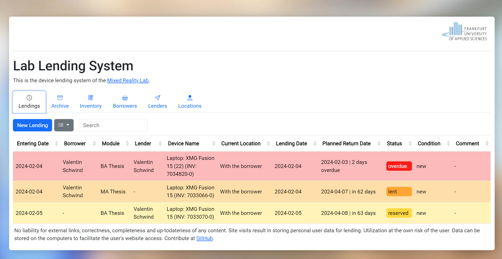

# Inventory and Lending Management System

This web application provides a comprehensive solution for managing inventory and lending operations for labs. It allows users to track devices, borrowers, and lenders, facilitating the lending process from start to finish.



## Features
Dynamic Data Tables: Utilize Bootstrap tables to dynamically display and manage inventory, borrowers, and lenders.
AJAX Data Fetching: Asynchronously load data from the server without reloading the page, enhancing user experience.
Form Handling: Dynamically generate forms for adding or updating inventory items, borrowers, and lenders.
Date Handling: Automatically calculate and display relevant dates, such as purchase dates and lending periods.
Status and Condition Tracking: Monitor and update the status and condition of inventory items.
Cookie-based Session Management: Use cookies to remember user actions and preferences across sessions.

## Getting Started

### Prerequisites

- A web server with PHP5 support (e.g., Apache, Nginx)
- MySQL or a compatible database system (e.g., MariaDB)
- Modern web browser with JavaScript enabled

### Installation

1. Clone the repository to your web server's document root:
2. ```git clone https://github.com/valentin-schwind/lab-lending-system.git```
3. Import the SQL schema located in sql/schema.sql into your database.
4. Configure your database connection settings in php/db_config.php.
5. Access the application through your web browser.

### Usage
1. Navigate to the application URL.
2. Use the Add buttons to add new inventory items, borrowers, or lenders.
3. Click on any table row to view detailed information or perform updates.
4. Utilize the search and filter functionalities to easily find specific entries.

## Contributing

Contributions are welcome! Please feel free to submit pull requests or open issues to suggest improvements or add new features.

### License
This project is licensed under the MIT License - see the LICENSE file for details.

### Acknowledgments
- Bootstrap for the responsive UI components.
- jQuery for simplifying DOM manipulations and AJAX calls.
- This template provides a basic structure for documenting a web application on GitHub. You can customize it further to match the specifics of your project, such as adding a section for configuration options, detailing API endpoints if applicable, or including screenshots to showcase the application's features.